

  
    

  
           

# Dollet 💸
Personal budget management application.

Ever wondered where "Dollet" comes from? It's a mashup of "Dol-" from Dollar 💵 and "-let" from Wallet 👜. This app helps store information about bank accounts and more in one place, while also tracking personal budgets by adding expenses and income.

It's like having a digital wallet for all financial needs! 💲

## Tech Stack

**Main:** .NET MAUI

**Dependencies:** 
- [CommunityToolkit.Mvvm](https://github.com/CommunityToolkit/Maui)
- [Microsoft.EntityFrameworkCore](https://www.nuget.org/packages/Microsoft.EntityFrameworkCore)
- [Freecurrencyapi](https://github.com/everapihq/freecurrencyapi-dotnet)
- [Microcharts](https://github.com/microcharts-dotnet/Microcharts)

## Requirements
- ✅ MVVM pattern
- ✅ Nice & modern UI layout
- ✅ Use currencies API
- ✅ Change app theme

## Features
- ✅ Accounts
  + ✅ Display all active
  + ✅ Display hidden
  + ✅ Adding new
  + ✅ Editing existing
  + ✅ Set as default

- ✅ Balance
  + ✅ Display sumable
  + ✅ Handle currency sumable
  + ✅ Handle calculating 

- ✅ Categories
  + ✅ Seed default categories
  + ✅ Reordering
  + ✅ Save handling
  + ✅ Expenses
  + ✅ Incomes

- ✅ Transactions
  + ✅ Expenses
    + ✅ Add new expense
    + ✅ Handle calculate account balance
    + ✅ Display all with filtering by day/week/month
    + ✅ Filter by custom date range
    + ✅ Display grouped by category
    + ✅ Edit existing
    + ✅ Display chart
  + ✅ Incomes
    + ✅ Add new income
    + ✅ Handle calculate account balance
    + ✅ Display all with filtering by day/week/month
    + ✅ Filter by custom date range
    + ✅ Display grouped by category
    + ✅ Edit existing
    + ✅ Display chart

- ✅ Currencies
  + ✅ Seed currencies
  + ✅ Display all
  + ✅ Change default
  + ✅ Handle calculating

- ✅ Setting
  + ✅ Change theme
    
## Demo
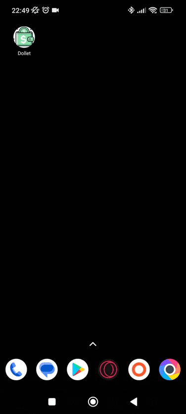

## Screenshots

### Accounts (Light/Dark)

  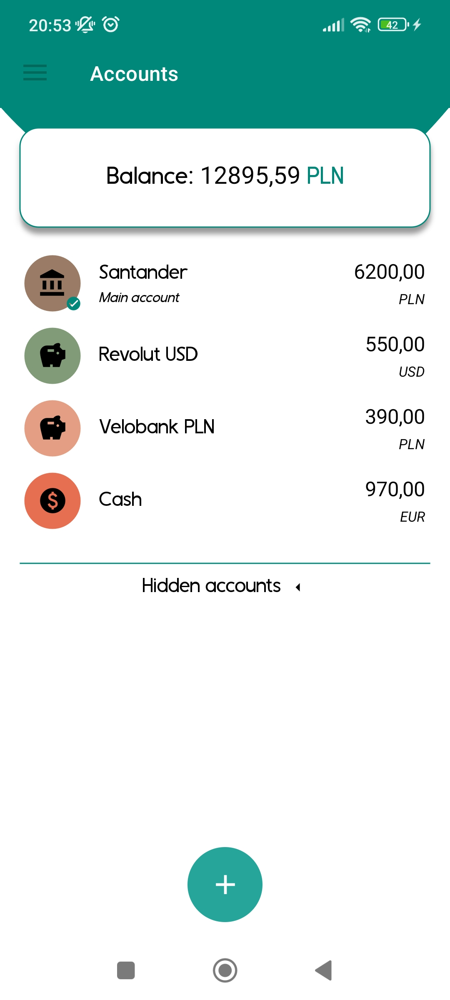
  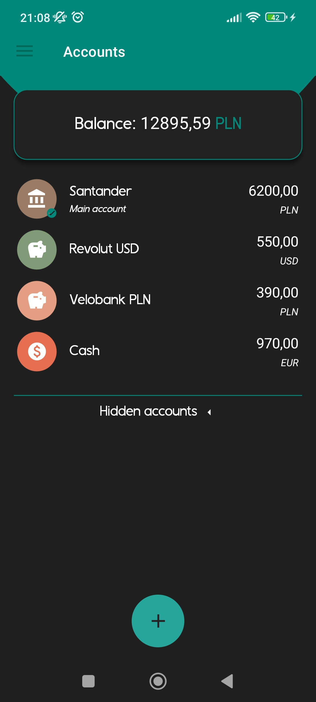

### Categories (Light/Dark)

  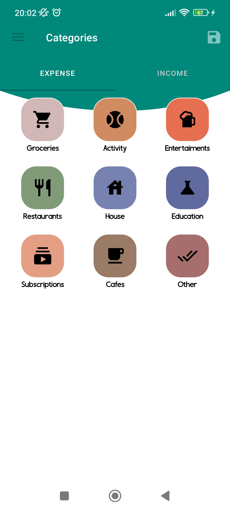
  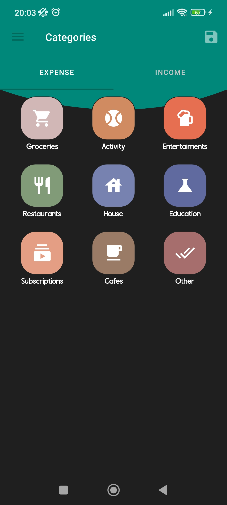

### Transactions (Expenses)

  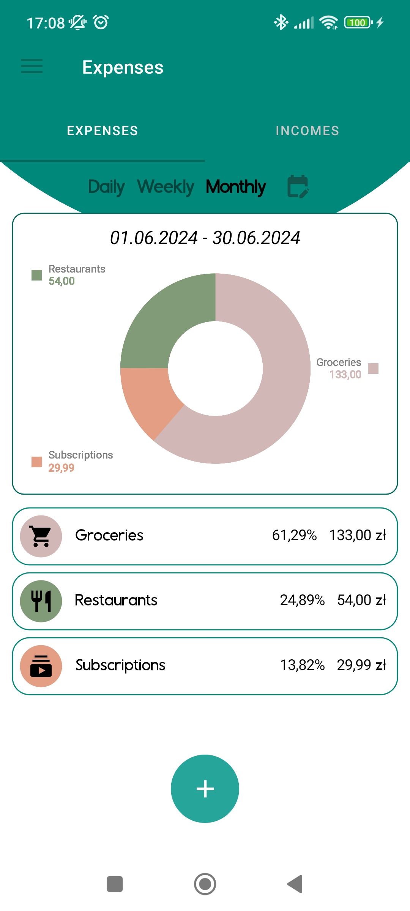
  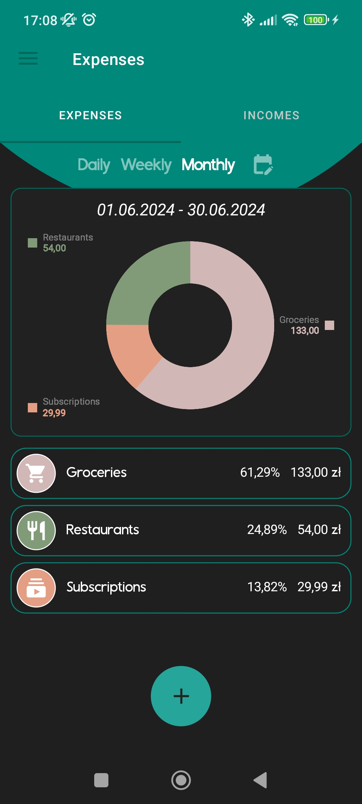

### Transactions (Expenses - Details)

  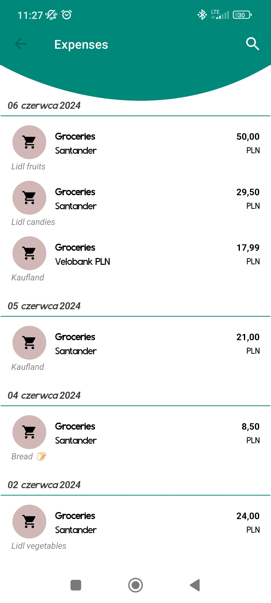
  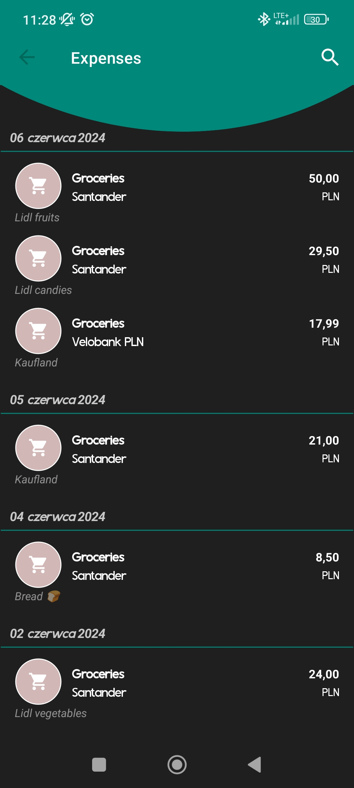

### Transactions (New Expense)

  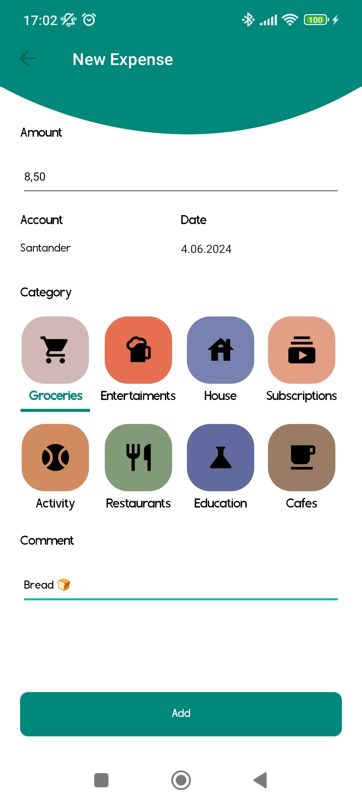
  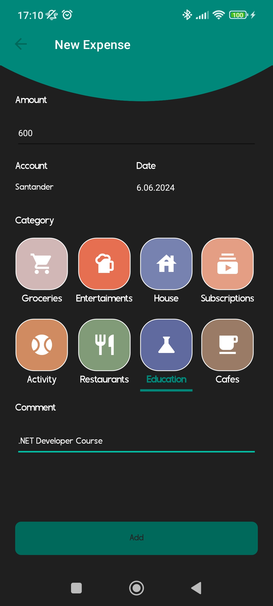

### Currencies

  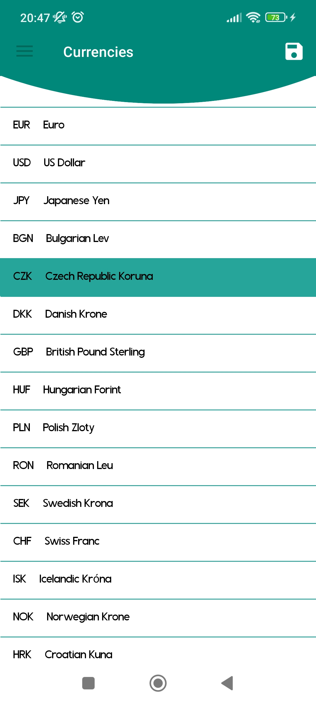
  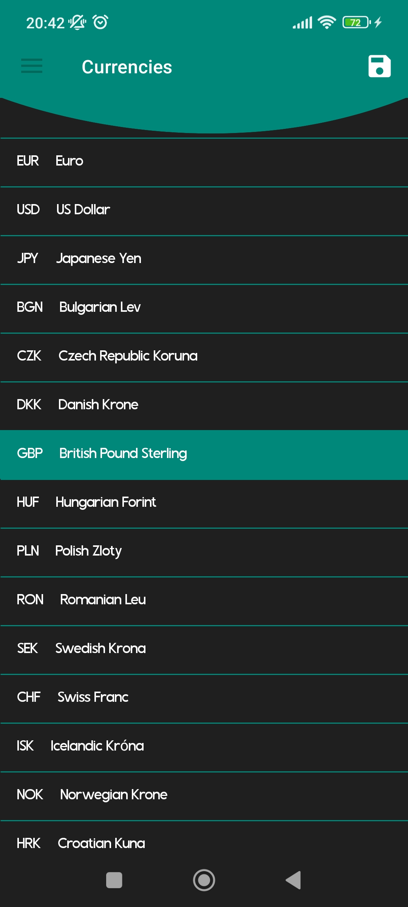

## Roadmap

- ⬜️ Add/Edit account same selected behavior as on Add/Edit transaction
- ⬜️ Add/Edit account invert hidden/default properties
- ⬜️ Reordering accounts
- ⬜️ Better layout for removing existing account
- ⬜️ Better reordering categories
- ⬜️ Add custom category
- ⬜️ Passing date to custom date range picker
- ⬜️ Better layout for date range picker 
- ⬜️ Search in transactions
- ⬜️ Go back to correct grouped category transaction details when transaction category changed
- ⬜️ Correct double click - back button behavior
---
- ⬜️ Account transfers
- ⬜️ Display transactions for account
- ⬜️ First run page with passing username and default currency
- ⬜️ Scheduled transactions
- ⬜️ Change default account image
- ⬜️ Wallets
- ⬜️ Settings
- ⬜️ Increase app performance

## Download [📲](https://github.com/gwalus/Dollet/releases/latest/download/dollet.apk)
